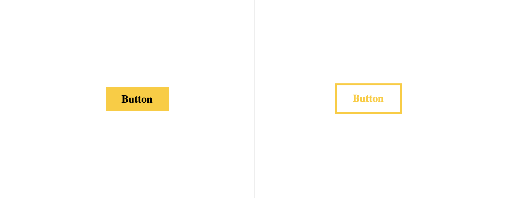
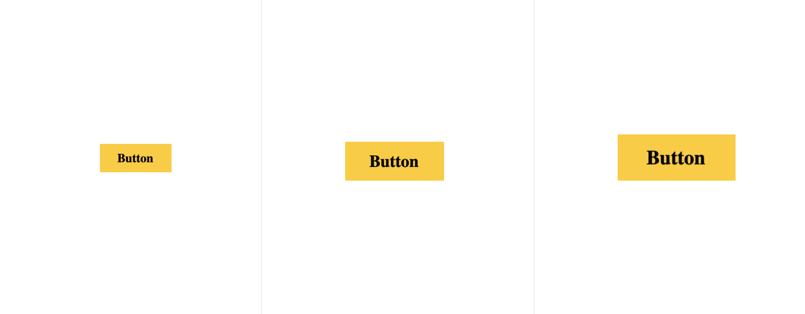
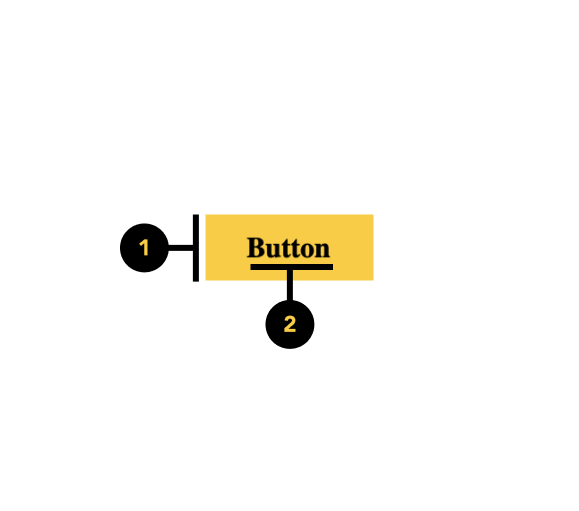

# Button

<PageDescription>

Mit einem Button wird eine Aktion initialisiert. Über die Button-Beschriftung wird angegeben, welche Aktion ausgeführt wird.

</PageDescription>

<AnchorLinks>
  <AnchorLink>Überblick</AnchorLink>
  <AnchorLink>Formartierung</AnchorLink>
  <AnchorLink>Code</AnchorLink>
  <AnchorLink>Inhalt</AnchorLink>
  <AnchorLink>Referenzen</AnchorLink>
  <AnchorLink>Feedback</AnchorLink>
</AnchorLinks>


## Überblick

Button sind anklickbare Elemente, mit denen Aktionen ausgelöst werden. Über den hier zur Verfügung gestellten Button ist es möglich auf verschiedene Weise mit Seiten zu interagieren.
Über die Button-Beschriftung wird dabei angegeben, welche Aktion ausgeführt wird.

#### Wann zu verwenden

Der Button ist für Verlinkung zu anderen Seiten zu benutzten.


### Varianten

Für den Button stehen zwei Varianten zur Verfügung

<Row>
<Column colLg={12}>



</Column>
</Row>

| Variant     | Purpose                                                                                                                                                                                                                                                                                                                                       |
| ----------- | --------------------------------------------------------------------------------------------------------------------------------------------------------------------------------------------------------------------------------------------------------------------------------------------------------------------------------------------- |
| _Primary_   | Der primäre Button besteht aus einem ausgefüllten Container und einem Label für aktive und relevante Aktionen                                                                                                                                                                         |
| _Secondary_ | Der sekundäre Button besteht aus einem Rahmen und einem Label für zusätzliche nicht aktive Aktionen |


### Größe

<Row>
<Column colLg={12}>



</Column>
</Row>


| Variant     | Purpose                                                                                                                                                                                                                                                                                                                                       |
| ----------- | --------------------------------------------------------------------------------------------------------------------------------------------------------------------------------------------------------------------------------------------------------------------------------------------------------------------------------------------- |
| _Small_  | For less prominent, and sometimes independent, actions. Tertiary buttons can be used in isolation or paired with a primary button when there are multiple calls to action. Tertiary buttons can also be used for sub-tasks on a page where a primary button for the main and final action is present.                                            |
| _Medium_     | For the least pronounced actions; often used in conjunction with a primary button. In a situation such as a progress flow, a ghost button may be paired with a primary and secondary button set, where the primary button is for forward action, the secondary button is for "Back", and the ghost button is for "Cancel".                    |
| _Large_     | For the least pronounced actions; often used in conjunction with a primary button. In a situation such as a progress flow, a ghost button may be paired with a primary and secondary button set, where the primary button is for forward action, the secondary button is for "Back", and the ghost button is for "Cancel".                    |


## Formartierung

### Anatomy

Der Button besteht aus einem Container und einem Label. Das Label ist dabei ein wichtiges Element, um die Aktion zu kommunizieren.

<ArtDirection>



</ArtDirection>

1. **Container**

2. **Label**


## Code

### Dokumentation

Das folgende Storybook zeigt den Button in einer Live Demo. Des Weiteren kann in dieser Testumgebung der Button mit verschiedenen Props und Variante getestet werden.

<Row className="resource-card-group">

<Column colMd={4} colLg={4} noGutterSm>
  <ResourceCard
    subTitle="React Dokumentation"
    actionIcon="launch"
    aspectRatio="2:1"
    href="https://github.com/cranach-design-system/cranach-design">

  </ResourceCard>

</Column>

</Row>


### Code

Button mit Standardwerten

```javaScript path=CodeSandbox src=https://gatsby-theme-carbon.now.sh

<Button />


```

Beispiel: Button mit der Übergabe aller möglichen props

```javaScript path=CodeSandbox src=https://gatsby-theme-carbon.now.sh

<Button
  primary={false}
  label={'zur Webseite'}
  size={'large'}
  href={'https://lucascranach.org'}
  backgroundColor={'grey'}
/>

```

#### Props

| property        | propType | default                        | Optionen                     | description |
| --------------- | -------- | ------------------------------ | ---------------------------- |------------------------------------------------------------------------------------ |
| label           | string   |  type your label               |                              | Beschriftung des Buttons |
| primary         | bool     |  true                          |  `true`, `false`             | Angabe über die Button-Variante |
| size            | string   |  medium                        | `small`, `medium`, `large`   | Festlegung der Größe, Standard  |
| href            | string   |  https://lucascranach.org      |                              | Die vollständige URL eines Links |
| backgroundColor | string   |  null                          |                              | Farbe des Button-Containers |

### Live Demo


## Inhalt

#### Label

Button-Beschriftungen sollten die Aktion des Button deutlich anzeigen. Um genügend Kontext bereitzustellen, verwenden die Inhaltsformel {Verb} + {Substantiv} für Schaltflächen, außer bei allgemeinen Aktionen wie "Fertig", "Schließen", "Abbrechen", "Hinzufügen" oder "Löschen".


## Referenzen

- Mehmet Goktürk,
  [_The Glossary of Human Computer Interaction, Chapter 37_](https://www.interaction-design.org/literature/book/the-glossary-of-human-computer-interaction/fitts-s-law)
  (The Interaction Design Foundation)
- Jakob Nielsen,
  [_OK-Cancel or Cancel-OK? The Trouble With Buttons_](https://www.nngroup.com/articles/ok-cancel-or-cancel-ok/)
  (Nielsen Norman Group, 2008)
- Artem Syzonenko
  [_Buttons on the web: placement and order_](https://uxdesign.cc/buttons-placement-and-order-bb1c4abadfcb)
  (UX Collective, 2019)


## Feedback

Helfe uns um diese Komponente/Pattern zu verbessern, indem sie Feedback geben, fragen stelle oder andere Kommentare auf [Github](https://github.com/cranach-design-system/cranach-design/issues/new?assignees=&labels=&template=website-feedback.md&title=Website+feedback) hinterlassen.
