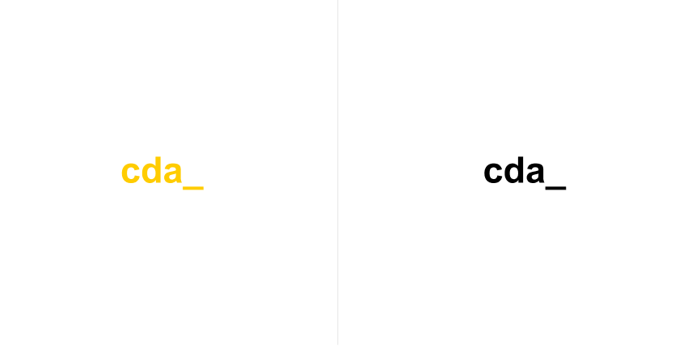
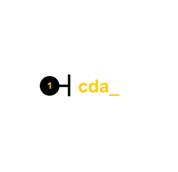

# Logo

<PageDescription>

Das Logo symbolisiert ein Zeichen, das ein Subjekt repräsentiert.

</PageDescription>

<AnchorLinks>
  <AnchorLink>Überblick</AnchorLink>
  <AnchorLink>Formartierung</AnchorLink>
  <AnchorLink>Code</AnchorLink>
  <AnchorLink>Inhalt</AnchorLink>
  <AnchorLink>Referenzen</AnchorLink>
  <AnchorLink>Feedback</AnchorLink>
</AnchorLinks>


## Überblick


Das Logo ist eine Zeichen für die Repräsentation eines Subjekts, wie Unternehmen, Organisation oder ein Produkt. Das Logo besteht dabei aus einer Text, dass aus zwei Varianten besteht


#### Wann zu verwenden

Das Logo ist für die repräsentation eines Subjektes zu verwenden.

### Varianten

Für das Logo stehen zwei Varianten zur Verfügung

<Row>
<Column colLg={12}>



</Column>
</Row>

| Variant     | Purpose                                                                                                                                                                                                                                                                                                                                       |
| ----------- | --------------------------------------------------------------------------------------------------------------------------------------------------------------------------------------------------------------------------------------------------------------------------------------------------------------------------------------------- |
| _Primary_   | Das primäre Logo wird mit der Textfarbe in Orange (#FFCC00) versehen |
| _Secondary_ | Das sekundäre Logo besteht aus einem Schwarz (#000) Text |


## Formartierung

### Anatomy

Das Logo besteht aus einem Text.

<ArtDirection>



</ArtDirection>

1. **Text**


## Code

### Dokumentation

Das folgende Storybook zeigt das Logo in einer Live Demo. Des Weiteren kann in dieser Testumgebung das Logo mit verschiedenen Variante getestet werden.

<Row className="resource-card-group">

<Column colMd={4} colLg={4} noGutterSm>
  <ResourceCard
    subTitle="React Dokumentation"
    actionIcon="launch"
    aspectRatio="2:1"
    href="https://storybook-cranachdesign.netlify.app/?path=/story/atoms-logo--primary">

  </ResourceCard>

</Column>

</Row>


### Code

Logo mit Standardwerten

```javaScript path=CodeSandbox src=https://gatsby-theme-carbon.now.sh

<Logo />


```

Beispiel: Logo mit der Übergabe aller möglichen props

```javaScript path=CodeSandbox src=https://gatsby-theme-carbon.now.sh

<Logo
  primary={false}
  logoTitle={'cranach digital archive_'}
/>

```

#### Props

| property        | propType | default                        | Optionen                     | description |
| --------------- | -------- | ------------------------------ | ---------------------------- |------------------------------------------------------------------------------------ |
| logoTitle       | string   |  cda_                          |                              | Beschriftung des Logos |
| primary         | bool     |  true                          |  `true`, `false`             | Angabe über die Logo-Variante |

### Live Demo


## Inhalt

#### Label

Der Logo-Inhalt bzw. Text soll die Beschriftung des Unternehmens, Organisation oder Produktes tragen


## Feedback

Helfe uns um diese Komponente/Pattern zu verbessern, indem sie Feedback geben, fragen stelle oder andere Kommentare auf [Github](https://github.com/cranach-design-system/cranach-design/issues/new?assignees=&labels=&template=website-feedback.md&title=Website+feedback) hinterlassen.
