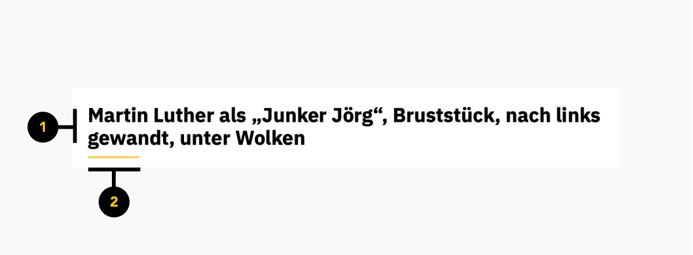

# Titel

<PageDescription>

Mit einem Title wird ein ein Inhalt in wenigen Worten zusammengefasst.

</PageDescription>

<AnchorLinks>
  <AnchorLink>Überblick</AnchorLink>
  <AnchorLink>Formartierung</AnchorLink>
  <AnchorLink>Code</AnchorLink>
  <AnchorLink>Referenzen</AnchorLink>
  <AnchorLink>Feedback</AnchorLink>
</AnchorLinks>


## Überblick

Title sind statische Elemente, die den Inhalt in wenigen Worten beschreiben sollen.

#### Wann zu verwenden

Der Title ist für Bereich mit weiteren detailierten Inhalt zu verwenden oder um eine Überschrift zu setzen.


## Formartierung

### Anatomy

Der Titel besteht aus einem Text und aus einer Linie, die den Text unterstreicht.


<ArtDirection>



</ArtDirection>

1. **Text**

2. **Unterstrich**


## Code

### Dokumentation

Das folgende Storybook zeigt den Titel in einer Live Demo. Des Weiteren kann in dieser Testumgebung der mit verschiedenen Texten getestet werden.

<Row className="resource-card-group">

<Column colMd={4} colLg={4} noGutterSm>
  <ResourceCard
    subTitle="React Dokumentation"
    actionIcon="launch"
    aspectRatio="2:1"
    href="https://github.com/cranach-design-system/cranach-design">

  </ResourceCard>

</Column>

</Row>


### Code

Button mit Standardwerten

```javaScript path=CodeSandbox src=https://gatsby-theme-carbon.now.sh

<Title />


```

Beispiel: Titel mit der Übergabe aller möglichen props

```javaScript path=CodeSandbox src=https://gatsby-theme-carbon.now.sh

<Title text={'Der neue Titel'}/>

```

#### Props

| property        | propType | default                        | Optionen                     | description |
| --------------- | -------- | ------------------------------ | ---------------------------- |------------------------------------------------------------------------------------ |
| text            | string   |  type your title               |                              | Beschriftung des Titels |

### Live Demo


## Referenzen


## Feedback

Helfe uns um diese Komponente/Pattern zu verbessern, indem sie Feedback geben, fragen stelle oder andere Kommentare auf [Github](https://github.com/cranach-design-system/cranach-design/issues/new?assignees=&labels=&template=website-feedback.md&title=Website+feedback) hinterlassen.
