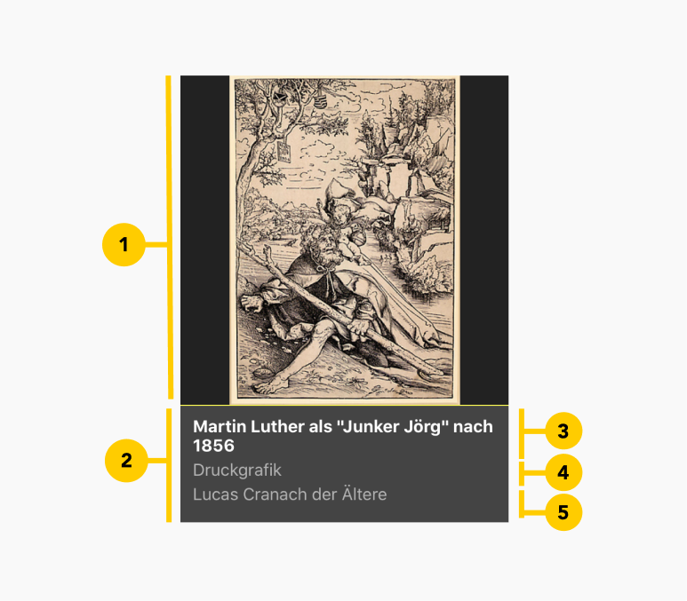

# ArtefactCard

<PageDescription>

Nutze ArtefactCard um Artefakten, Gemälde, Archivalien und sonstige digitale Kunstwerke in Kachelform darzustellen.

</PageDescription>

<AnchorLinks>
  <AnchorLink>Überblick</AnchorLink>
  <AnchorLink>Live Demo</AnchorLink>
  <AnchorLink>Formartierung</AnchorLink>
  <AnchorLink>Referenzen</AnchorLink>
  <AnchorLink>Feedback</AnchorLink>
</AnchorLinks>


## Überblick

ArtefactCard visualisiert digitale Kunstwerke in Kachelform mit den ersten notwendigen Daten.

#### Wann zu verwenden

ArtefactCard ist für die Listung eines digitalen Kunstwerkes zu verwenden.


## Formatierung

### Anatomy

<ArtDirection>



</ArtDirection>

The modal is composed of three distinct zones: A header, the body, and a footer.
Components (eg. data table, form, progress indicator) can occupy the full width
of the modal.

1. **Bildbereich**: Enthält das Bild des digitalen Kunswerkes

2. **Inhaltsbereich**: Enthält den Titel, Subtitel und die Klassifikation des digitalen Kunstwerkes

3. **Titel**: Gibt die Hauptbezeichnung des digitalen Kunstwerkes

4. **Subtitel**: Beschreibt den Untertitel

5. **Klassifikation**: Die Klassifikation des Kunstwerkes


## Code

### Dokumentation

Das folgende Storybook zeigt ArtefactCard in einer Live Demo. Des Weiteren kann in dieser Testumgebung der Button mit verschiedenen Props und Variante getestet werden.

<Row className="resource-card-group">

<Column colMd={4} colLg={4} noGutterSm>
  <ResourceCard
    subTitle="React Dokumentation"
    actionIcon="launch"
    aspectRatio="2:1"
    href="https://storybook-cranachdesign.netlify.app/?path=/story/molecules-artefactcard--template">

  </ResourceCard>

</Column>

</Row>


### Code

ArtefactCard mit Standardwerten

```javaScript path=CodeSandbox src=https://gatsby-theme-carbon.now.sh

<ArtefactCard />

```

Beispiel: ArtefactCard mit der Übergabe aller möglichen props

```javaScript path=CodeSandbox src=https://gatsby-theme-carbon.now.sh

<ArtefactCard
  title={'Martin Luther als „Junker Jörg“'}
  subtitle={'Lucas Cranach der Ältere'}
  date={'1829'}
  classification={'Druckgrafik'}
  imgSrc={'https://lucascranach.org/application/files/5715/2205/3270/Martin-Luther-als-Junker-Joerg.jpg'}
  imgAlt={'lucas cranach image'}
/>

```

#### Props

| property        | propType | default                            | Optionen                     | description |
| --------------- | -------- | ------------------------------     | ---------------------------- |------------------------------------------------------------------------------------ |
| title           | string   |  Doppelbildnis Friedrich der Weise |                              | Haupttitel von des digitalen Kunstwerks |
| subtitle        | string   |  Lucas Cranach der Ältere          |                              | Subtitel von des digitalen Kunstwerks |
| date            | string   |  1877                              |                              | Datum von des digitalen Kunstwerks |
| classification  | string   |  Druckgrafik                       |                              | Klassifikation von des digitalen Kunstwerks |
| imgSrc          | string   |  https://lucascranach.org/application/files/1715/2120/9916/Portraet001.jpg                       |                              | Bild von des digitalen Kunstwerks |
| imgAlt          | string   |  Cranach Image                       |                              | Alternativer Bildtext von des digitalen Kunstwerks |


## Referenzen

Siehe [Beispiel](https://lucascranach.org/graphics/de)


## Feedback

Helfe uns um diese Komponente/Pattern zu verbessern, indem sie Feedback geben, fragen stelle oder andere Kommentare auf [Github](https://github.com/cranach-design-system/cranach-design/issues/new?assignees=&labels=&template=website-feedback.md&title=Website+feedback) hinterlassen.
