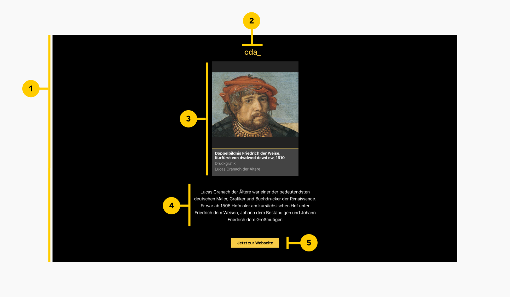

# ArtefactIntro

<PageDescription>

Nutze ArtefactCard um Artefakten, Gemälde, Archivalien und sonstige digitale Kunstwerke in Kachelform darzustellen.

</PageDescription>

<AnchorLinks>
  <AnchorLink>Überblick</AnchorLink>
  <AnchorLink>Code</AnchorLink>
  <AnchorLink>Formartierung</AnchorLink>
  <AnchorLink>Feedback</AnchorLink>
</AnchorLinks>


## Überblick

ArtefactCard visualisiert digitale Kunstwerke in Kachelform mit den ersten notwendigen Daten.

#### Wann zu verwenden

ArtefactCard ist für die Listung eines digitalen Kunstwerkes zu verwenden.


## Formatierung

### Anatomy

<ArtDirection>



</ArtDirection>

Dieser Organismus besteht auch Atome und Moleküle bildet einen Intro-Bereich ab.

The modal is composed of three distinct zones: A header, the body, and a footer.
Components (eg. data table, form, progress indicator) can occupy the full width
of the modal.

1. **Container**: Container in schwarzer Hintergrundfarbe. Zentriert alle Inhalte

2. **Logo**: Enthält ein [Logo (Atom)](../../atoms/Logo)

3. **ArtefactCard**: Enthält das Molekül [ArtefactCard (Molecule)](../../molecules/artefactCard)

4. **Paragraph**: Ein Paragraphtext für eine detailierte Erläuterung dieses Intros

5. **Button**: Enthält eine [Button (Atom)](../../atoms/Button)


## Code

### Dokumentation

Das folgende Storybook zeigt ArtefactIntro in einer Live Demo. Des Weiteren kann in dieser Testumgebung Artefact mit verschiedenen Props und Variante getestet werden.

<Row className="resource-card-group">

<Column colMd={4} colLg={4} noGutterSm>
  <ResourceCard
    subTitle="React Dokumentation"
    actionIcon="launch"
    aspectRatio="2:1"
    href="https://github.com/cranach-design-system/cranach-design">

  </ResourceCard>

</Column>

</Row>


### Code

Button mit Standardwerten

```javaScript path=CodeSandbox src=https://gatsby-theme-carbon.now.sh

<ArtefactIntro />

```

Beispiel: Button mit der Übergabe aller möglichen props

```javaScript path=CodeSandbox src=https://gatsby-theme-carbon.now.sh

<ArtefactIntro
  logoTitle={'cranach digital archive_'}
  artefactCardTitle={'Doppelbildnis Friedrich der Weise'}
  artefactCardSubtitle={'Lucas Cranach der Ältere'}
  artefactCardDate={'1510'}
  artefactCardImgSrc={'https://lucascranach.org/application/files/5715/2205/3270/Martin-Luther-als-Junker-Joerg.jpg'}
  artefactCardImgAlt={'cranach image'}
  artefactCardClassification={'Druckgrafik'}
  paragraphText={'Lucas Cranach der Ältere war einer der bedeutendsten deutschen Maler, Grafiker und Buchdrucker der Renaissance.'}
  buttonSize={'large'}
  buttonLabel={'Jetzt zur Webseite'}
/>

```

#### Props

| property        | propType | default                            | Optionen                     | description |
| --------------- | -------- | ------------------------------     | ---------------------------- |------------------------------------------------------------------------------------ |
| logoTitle           | string   |  cda_ |                              | Beschriftung des Logos |
| artefactCardTitle        | string   |   Doppelbildnis Friedrich der Weise       |                              | Haupttitel von des digitalen Kunstwerks |
| artefactCardSubtitle            | string   |  Lucas Cranach der Ältere                              |                              | Subtitel von des digitalen Kunstwerks |
| artefactCardDate  | string   |  1510                       |                              | Datum von des digitalen Kunstwerks |
| artefactCardImgSrc          | string   |  https://lucascranach.org/application/files/1715/2120/9916/Portraet001.jpg                       |                              | Bild von des digitalen Kunstwerks |
| artefactCardImgAlt          | string   |  Cranach Image                       |                              | Alternativer Bildtext von des digitalen Kunstwerks |
| artefactCardClassification          | string   |  Lucas Cranach der Ältere                       |                              | Klassifikation von des digitalen Kunstwerks |
| paragraphText          | string   |  type your text                       |                              | Detaillierter Text zur Erläuterung des Intros |
| buttonSize          | string   |  medium                       |                    `small`, `medium`, `large`        | Festlegung der Größe, Standard |
| buttonLabel          | string   |  type your label                       |                              | Beschriftung des Buttons |


## Feedback

Helfe uns um diese Komponente/Pattern zu verbessern, indem sie Feedback geben, fragen stelle oder andere Kommentare auf [Github](https://github.com/cranach-design-system/cranach-design/issues/new?assignees=&labels=&template=website-feedback.md&title=Website+feedback) hinterlassen.
