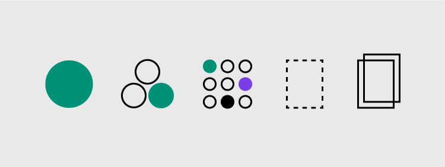

# Überblick

Pattern und Komponenten sind wichtige Bestandteile ​​des Design Systems. Ihre systematische Wiederverwendung trägt dazu bei, eine visuelle und funktionale Konsistenz zwischen den Produkten zu schaffen.

## Pattern und Komponenten

Jedes Pattern wurde entwickelt, um ein bestimmtes UI-Problem zu lösen. Alle Pattern und Komponenten in Cranach Design sollen so konzipiert werden, dass sie als Teile eines größeren Ganzen harmonisch zusammenarbeiten. Derzeit werden nur wenige Komponenten und Pattern zur Testzwecken bereitgestellt. Die Pattern und Komponenten auf Basis des Atomic Design-Ansatzes systematisiert.

## Atomic Design

[Atomic Design](https://atomicdesign.bradfrost.com) ist ein Ansatz zur systematisierung der UI. Dieser Ansatz folgt dabei der chemischen Anatomie und besteht dabei aus Atome, Moleküle und Organismen. Diese Struktur bring ebenfalls eine Hierarchie mit um Komponenten unterscheiden und konkretisieren/verallgemeinern zu können.

1. **Atoms**: Grundbausteine der Benutzeroberfläche. Z.B.: Titel, Button, Input-Feld. [Jetzt zu den Atomen](./../atoms/button)

2. **Molecules**: Gruppe aus aus Atomen die ein Molekül bilden, die zu einer Einheit werden. Z.B. Eine Input-Feld mit einem Label und einem Button. [Jetzt zu den Molekülen](./../molecules/artefactCard)

3. **Organism**: Bestehen aus Gruppen von Molekülen und/oder Atomen und/oder anderen Organismen. Diese Organismen bilden Abschnitte einer Seite. Z.B. Ein Kopf-Bereich, bestehend aus einem Logo, Fomular und einer Navigation. [Jetzt zu den Organismen](./../organism/artefactIntro)

<ArtDirection>

</ArtDirection>
